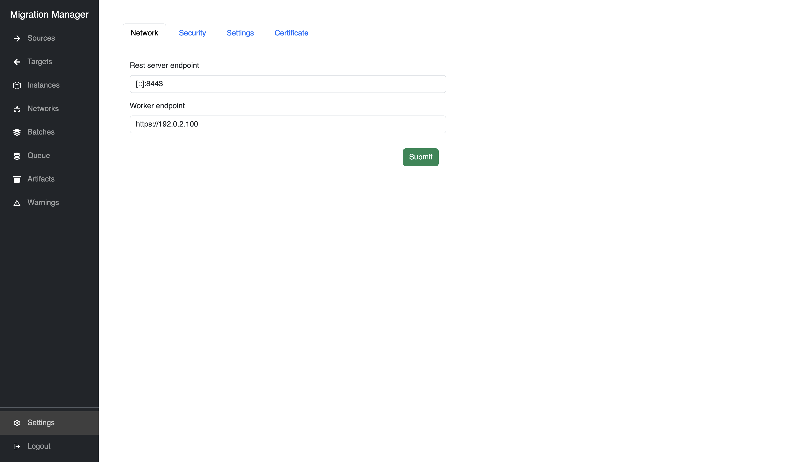
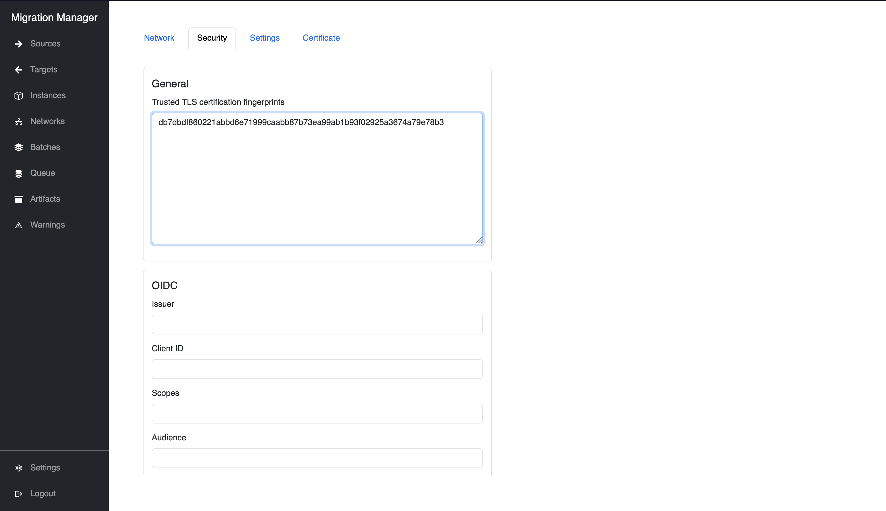

# Accessing the system (UI)

## From the web
The Migration Manager UI is also available for web access.

For this to work, a client certificate trusted by Migration Manager must be imported as a user certificate in your web browser.

The remote CLI keypair generated in `~/.config/migration-manager` is one such example that can be used for this purpose (See: [Accessing Migration Manager (Command line)](access_cli).

The exact process to do this varies between browsers and operating
systems, but generally involves generating a PKCS#12 certificate from
the separate `client.crt` and `client.key`, then importing that in the
web browser's certificate store.

Alternatively, the UI can be accessed with OIDC login if configured on the Migration Manager service.

## Changing settings with the UI

System, network, and security settings can be modified from the UI.

### Change the network configuration

Here you can change the address that the Migration Manager service uses for its API and for connections between the service and registered targets:

In this example, the Migration Manager API is served on port `8443` on every available address, and connections between the migration target and the Migration Manager service will use `https://192.0.2.100:443`.

```{note}
The worker endpoint must be set to a specific address for Migrations to proceed.
Migration Manager does not explicitly listen on the specified worker endpoint.
```



### Add or remove trusted TLS client certificate fingerprints

The TLS certificate fingerprints of trusted clients must be registered in Migration Manager for any non-local clients and migration targets.


