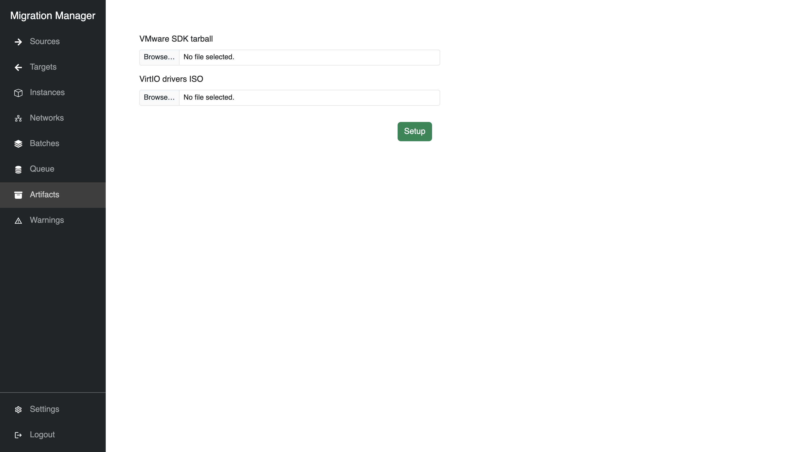
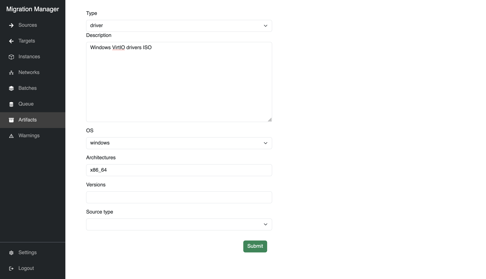

# Artifacts

Some external files are required for migrations to take place.

* All VMware VMs require the VMware VIX disklib (VDDK) tarball to be imported into Migration Manager

* Windows VMs require the [virtio-win drivers](https://github.com/virtio-win/virtio-win-pkg-scripts/blob/master/README.md) to be imported into Migration Manager

`````{tabs}

````{group-tab} Web interface

Use `Setup` for common artifacts like the VMware VIX SDK or the Windows VirtIO drivers for `x86_64`:



Use `Create artifact` for customized artifacts for particular operating systems, versions, or architectures:



````

````{group-tab} Command line

Adding the VMware SDK

    migration-manager artifact upload sdk vmware /path/to/VMware-vix-disklib.tar.gz

Adding the VirtIO Windows drivers ISO

    migration-manager artifact upload driver windows /path/to/virtio-win.iso x86_64

````

`````

```{note}
Architectures for different Windows VMs being migrated require their own artifacts.
```
