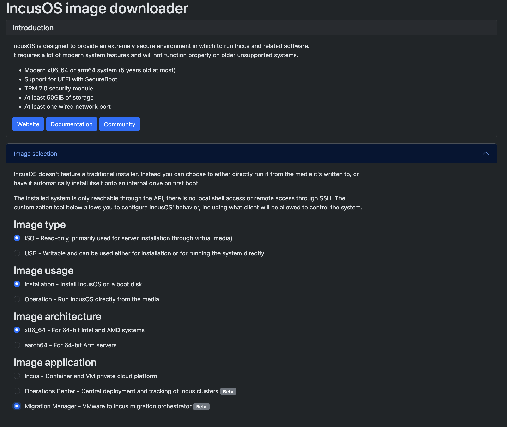

# Install with IncusOS

Migration Manager can be installed as an application with [IncusOS](https://linuxcontainers.org/incus-os/docs/main/).

Refer to [Getting an IncusOS image](https://linuxcontainers.org/incus-os/docs/main/getting-started/download/) for obtaining the initial IncusOS image.

Ensure that Migration Manager is selected, whether using the [IncusOS customizer](https://linuxcontainers.org/incus-os/docs/main/getting-started/download/#incusos-customizer) or the [flasher tool](https://linuxcontainers.org/incus-os/docs/main/getting-started/download/#flasher-tool).

`````{tabs}

````{group-tab} Web interface



````

````{group-tab} Command line

When using the flasher tool, the access configuration for Migration Manager can be customized:

    Customization options:
    1) Select applications
    2) Configure network seed
    3) Write image and exit

    Selection: 1

    Application selection:
    1) Incus
    2) Migration Manager
    3) Operations Center
    4) None

    Selection: 2

    Customization options:
    1) Select applications
    2) Configure network seed
    3) Configure Migration Manager seed
    4) Write image and exit

    Selection: 3

Example Migration Manager seed:

    trusted_client_certificates:
      - e385d0e91509d33f0a3ff2d5993bd1fc6e6265140b5f11b7e3d20801480e3fbf
    preseed:
      system_network:
        rest_server_address: '192.0.2.100:443'
        worker_endpoint: https://example.com

````

`````

Then, simply follow the [IncusOS installation](https://linuxcontainers.org/incus-os/docs/main/getting-started/installation/) instructions and Migration Manager will be immediately available upon completing setup.

If the preseed is not customized when setting up IncusOS, then by default Migration Manager will be available on port `8443` on all network interfaces, and will trust the certificate supplied to IncusOS when generating the image. Refer to [Accessing the system (UI)](../getting-started/access_ui) for using Migration Manager from the web interface, or [Accessing the system (Command line)](../getting-started/access_cli) for using Migration Manager from the command line.

See [Migration Manager IncusOS Application](https://linuxcontainers.org/incus-os/docs/main/reference/applications/migration-manager/) for more details about IncusOS-specific configuration for Migration Manager.
