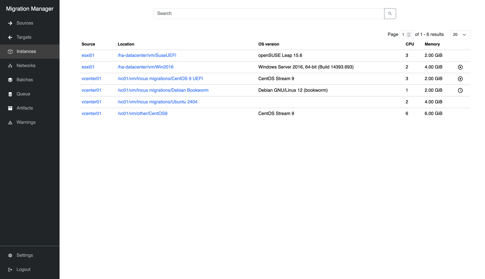
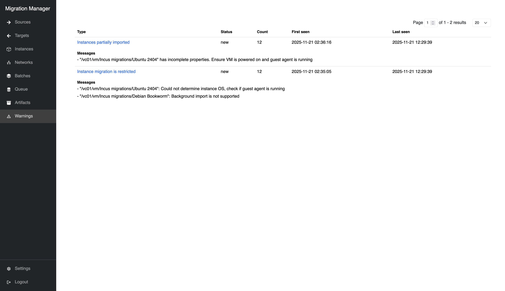
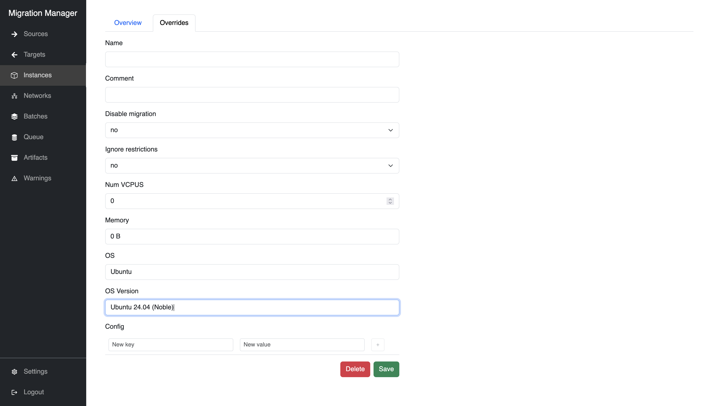
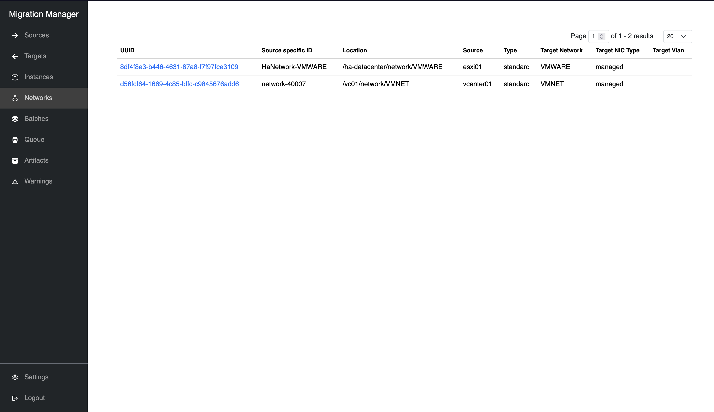
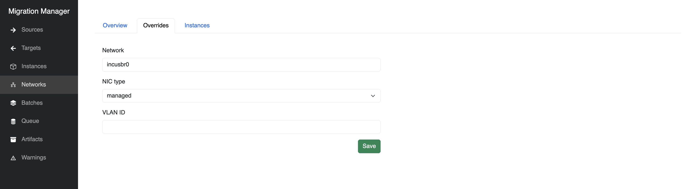
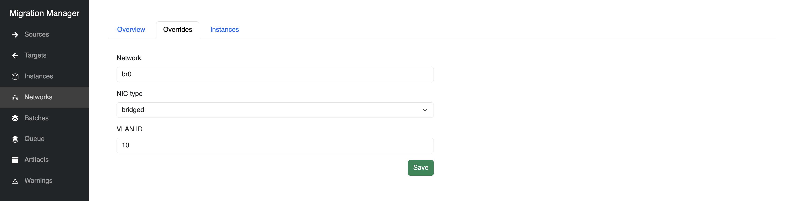
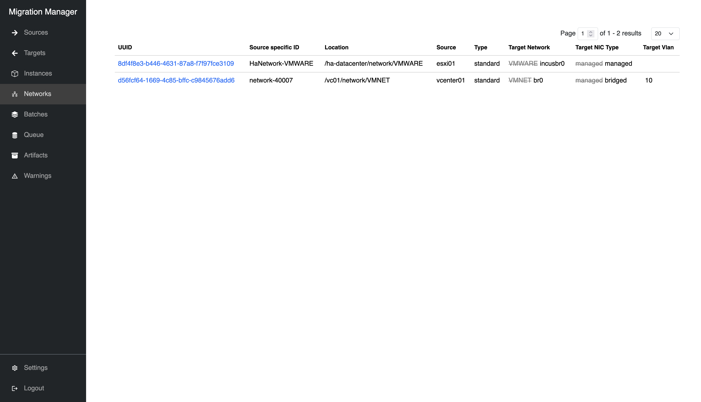
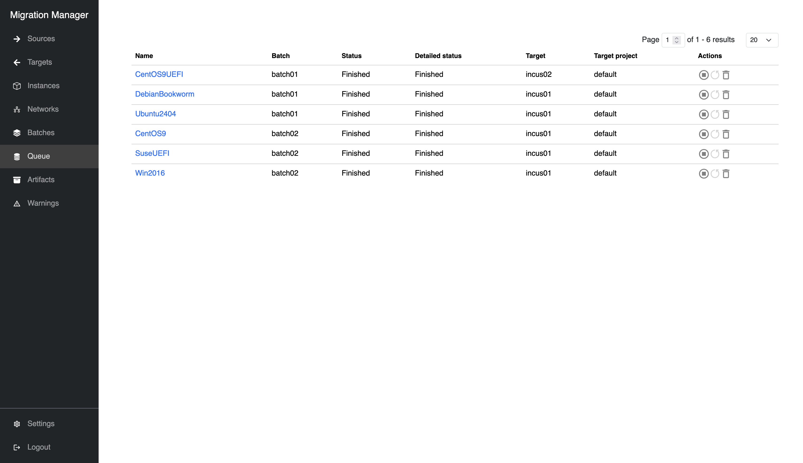

# Complex migrations (UI)

Migrations can be performed from multiple sources to multiple targets simultaneously, within the same batch or across multiple concurrent batches.

In this example, instances from two VMware sources (`esxi01` and `vcenter01`) will be migrated to two Incus targets (`incus01` and `incus02`).

## Register sources & targets

Refer to [Register a source (ESXi)](migrate_esxi.md#register-a-source) and [Register a target (Incus)](migrate_esxi.md#register-a-target) for a step by step guide.

The process of registering sources and targets is the same for vCenter and ESXi.

## Overriding instances

Inspect the instance records that were imported from the sources:

`````{tabs}

````{group-tab} Web interface



````

````{group-tab} Command line

    $ migration-manager instance list
    +--------------------------------------+-----------+-------------------------------------------+-----------------------------------------------+------+---------+-------------------+--------------------+
    |                 UUID                 | Source    |             Location                      |                  OS Version                   | CPUs | Memory  | Background Import | Migration Disabled |
    +--------------------------------------+-----------+-------------------------------------------+-----------------------------------------------+------+---------+-------------------+--------------------+
    | 52cfcb6b-20ee-add3-adc9-68c63ca9adfd | esxi01    | /ha-datacenter/vm/Win2016                 | Windows Server 2016, 64-bit (Build 14393.693) | 2    | 4.00GiB | true              | false              |
    +--------------------------------------+-----------+-------------------------------------------+-----------------------------------------------+------+---------+-------------------+--------------------+
    | 5298cc11-96ea-4f50-b018-6d80bfdaa7d9 | esxi01    | /ha-datacenter/vm/SuseUEFI                | openSUSE Leap 15.6                            | 3    | 6.00GiB | true              | false              |
    +--------------------------------------+-----------+-------------------------------------------+-----------------------------------------------+------+---------+-------------------+--------------------+
    | 52d5cfe0-d341-82d9-3f23-4149687b4e3e | vcenter01 | /vc01/vm/Incus migrations/Ubuntu 2404     |                                               | 2    | 4.00GiB | true              | false              |
    +--------------------------------------+-----------+-------------------------------------------+-----------------------------------------------+------+---------+-------------------+--------------------+
    | 52d89a93-ff8f-9dea-4d74-ec99beb1d2d4 | vcenter01 | /vc01/vm/Incus migrations/Debian Bookworm | Debian GNU/Linux 12 (bookworm)                | 3    | 6.00GiB | false             | false              |
    +--------------------------------------+-----------+-------------------------------------------+-----------------------------------------------+------+---------+-------------------+--------------------+
    | 5263adbf-dbca-eb36-3019-b09743f40b6d | vcenter01 | /vc01/vm/Incus migrations/Cent OS 9 UEFI  | CentOS Stream 9                               | 6    | 6.00GiB | true              | false              |
    +--------------------------------------+-----------+-------------------------------------------+-----------------------------------------------+------+---------+-------------------+--------------------+
    | 2f83c3b1-7966-4ff7-a671-79f163f28b3e | vcenter01 | /vc01/vm/other/CentOS9                    | CentOS Stream 9                               | 6    | 6.00GiB | true              | false              |
    +--------------------------------------+-----------+-------------------------------------------+-----------------------------------------------+------+---------+-------------------+--------------------+

`````

In the above instance list, it appears `/vc01/vm/Incus migrations/Ubuntu 2404` did not get an assigned `OS Version`. We can inspect the warnings to learn more:

`````{tabs}

````{group-tab} Web interface



````

````{group-tab} Command line

    $ migration-manager warning list
    +--------------------------------------+--------+-------+-------------+--------+----------------------------------+-----------------------------------------+--------------+-------+
    |                 UUID                 | Status | Scope | Entity Type | Entity |               Type               |              Last Updated               | Num Messages | Count |
    +--------------------------------------+--------+-------+-------------+--------+----------------------------------+-----------------------------------------+--------------+-------+
    | 40043116-7a1b-436e-be95-ea1e65a37016 | new    | sync  | source      | esxi01 | Instances partially imported     | 2025-11-18 23:47:23.992054737 +0000 UTC | 1            | 12    |
    +--------------------------------------+--------+-------+-------------+--------+----------------------------------+-----------------------------------------+--------------+-------+
    | c2841bda-fe78-41c1-974d-c760dddb074b | new    | sync  | source      | esxi01 | Instance migration is restricted | 2025-11-18 23:47:23.991759082 +0000 UTC | 2            | 12    |
    +--------------------------------------+--------+-------+-------------+--------+----------------------------------+-----------------------------------------+--------------+-------+

Inspect the warnings for more details:

    $ migration-manager warning show 40043116-7a1b-436e-be95-ea1e65a37016
    status: new
    uuid: 40043116-7a1b-436e-be95-ea1e65a37016
    scope:
        scope: sync
        entity_type: source
        entity: esxi01
    type: Instances partially imported
    first_seen_date: 2025-11-18T23:21:03.714646212Z
    last_seen_date: 2025-11-18T23:47:23.992012696Z
    updated_date: 2025-11-18T23:47:23.992054737Z
    messages:
        - '"/vc01/vm/Incus migrations/Ubuntu 2404" has incomplete properties. Ensure VM is powered on and guest agent is running'
    count: 12

    $ migration-manager warning show c2841bda-fe78-41c1-974d-c760dddb074b
    status: new
    uuid: c2841bda-fe78-41c1-974d-c760dddb074b
    scope:
        scope: sync
        entity_type: source
        entity: esxi01
    type: Instance migration is restricted
    first_seen_date: 2025-11-18T23:11:02.106883349Z
    last_seen_date: 2025-11-18T23:47:23.991697571Z
    updated_date: 2025-11-18T23:47:23.991759082Z
    messages:
        - '"/vc01/vm/Incus migrations/Ubuntu 2404": Could not determine instance OS, check if guest agent is running'
        - '"/vc01/vm/Incus migrations/Debian Bookworm": Background import is not supported'
    count: 12

`````

This suggests the VMware guest agent tools were not installed on the VM. We can re-install them on `Ubuntu 2404` and resync the source, or we can manually override the VM's properties:

`````{tabs}

````{group-tab} Web interface



````

````{group-tab} Command line

    $ migration-manager instance override edit 52d5cfe0-d341-82d9-3f23-4149687b4e3e
    ### This is a YAML representation of instance override configuration.
    ### Any line starting with a '# will be ignored.
    ###

    last_update: 2025-11-18T23:53:11.068675129Z
    comment: "Override OS and OS version (no VMware guest agent)"
    disable_migration: false
    ignore_restrictions: false
    properties:
        name: ""
        description: ""
        cpus: 0
        memory: 0
        config: {}
        os: "Ubuntu"
        os_version: "Ubuntu 24.04 (Noble)"
        architecture: ""

The instance list should now reflect the change:

    $ migration-manager instance list
    +--------------------------------------+-----------+-------------------------------------------+-----------------------------------------------+------+---------+-------------------+--------------------+
    |                 UUID                 | Source    |             Location                      |                  OS Version                   | CPUs | Memory  | Background Import | Migration Disabled |
    +--------------------------------------+-----------+-------------------------------------------+-----------------------------------------------+------+---------+-------------------+--------------------+
    | 52cfcb6b-20ee-add3-adc9-68c63ca9adfd | esxi01    | /ha-datacenter/vm/Win2016                 | Windows Server 2016, 64-bit (Build 14393.693) | 2    | 4.00GiB | true              | false              |
    +--------------------------------------+-----------+-------------------------------------------+-----------------------------------------------+------+---------+-------------------+--------------------+
    | 5298cc11-96ea-4f50-b018-6d80bfdaa7d9 | esxi01    | /ha-datacenter/vm/SuseUEFI                | openSUSE Leap 15.6                            | 3    | 6.00GiB | true              | false              |
    +--------------------------------------+-----------+-------------------------------------------+-----------------------------------------------+------+---------+-------------------+--------------------+
    | 52d5cfe0-d341-82d9-3f23-4149687b4e3e | vcenter01 | /vc01/vm/Incus migrations/Ubuntu 2404     | Ubuntu 24.04 (Noble)                          | 2    | 4.00GiB | true              | false              |
    +--------------------------------------+-----------+-------------------------------------------+-----------------------------------------------+------+---------+-------------------+--------------------+
    | 52d89a93-ff8f-9dea-4d74-ec99beb1d2d4 | vcenter01 | /vc01/vm/Incus migrations/Debian Bookworm | Debian GNU/Linux 12 (bookworm)                | 3    | 6.00GiB | false             | false              |
    +--------------------------------------+-----------+-------------------------------------------+-----------------------------------------------+------+---------+-------------------+--------------------+
    | 5263adbf-dbca-eb36-3019-b09743f40b6d | vcenter01 | /vc01/vm/Incus migrations/Cent OS 9 UEFI  | CentOS Stream 9                               | 6    | 6.00GiB | true              | false              |
    +--------------------------------------+-----------+-------------------------------------------+-----------------------------------------------+------+---------+-------------------+--------------------+
    | 2f83c3b1-7966-4ff7-a671-79f163f28b3e | vcenter01 | /vc01/vm/other/CentOS9                    | CentOS Stream 9                               | 6    | 6.00GiB | true              | false              |
    +--------------------------------------+-----------+-------------------------------------------+-----------------------------------------------+------+---------+-------------------+--------------------+

`````

## Overriding networks

Inspect the network records that were imported from the sources:

`````{tabs}

````{group-tab} Web interface



````

````{group-tab} Command line

    $ migration-manager network list
    +--------------------------------------+--------------------+-------------------------------+-----------+----------+----------------+-----------------+-------------+
    |                 UUID                 | Source Specific ID |           Location            | Source    |   Type   | Target Network | Target NIC Type | Target Vlan |
    +--------------------------------------+--------------------+-------------------------------+-----------+----------+----------------+-----------------+-------------+
    | 8df4f8e3-b446-4631-87a8-f7f97fce3109 | HaNetwork-VMWARE   | /ha-datacenter/network/VMWARE | esxi01    | standard | VMWARE         | managed         |             |
    +--------------------------------------+--------------------+-------------------------------+-----------+----------+----------------+-----------------+-------------+
    | d56fcf64-1669-4c85-bffc-c9845676add6 | network-40007      | /vc01/network/VMNET           | vcenter01 | standard | VMNET          | managed         |             |
    +--------------------------------------+--------------------+-------------------------------+-----------+----------+----------------+-----------------+-------------+

````

`````

In the above example, the `Target Network` for the ESXi network `/ha-datacenter/network/VMWARE` has been determined to be `VMWARE` however if no such network exists on the [Incus](https://linuxcontainers.org/incus/) target, we will need to override it:

`````{tabs}

````{group-tab} Web interface





````

````{group-tab} Command line

    $ migration-manager network edit 8df4f8e3-b446-4631-87a8-f7f97fce3109
    ### This is a YAML representation of network configuration.
    ### Any line starting with a '# will be ignored.
    ###

    network: "incusbr0"
    nictype: "managed"
    vlan_id: ""

    $ migration-manager network edit 52d5cfe0-d341-82d9-3f23-4149687b4e3e
    ### This is a YAML representation of network configuration.
    ### Any line starting with a '# will be ignored.
    ###

    network: "br0"
    nictype: "bridged"
    vlan_id: "10"

````

`````

Inspect the networks again to see the change:

`````{tabs}

````{group-tab} Web interface



````

````{group-tab} Command line

    $ migration-manager network list
    +--------------------------------------+--------------------+-------------------------------+-----------+----------+----------------+-----------------+-------------+
    |                 UUID                 | Source Specific ID |           Location            | Source    |   Type   | Target Network | Target NIC Type | Target Vlan |
    +--------------------------------------+--------------------+-------------------------------+-----------+----------+----------------+-----------------+-------------+
    | 8df4f8e3-b446-4631-87a8-f7f97fce3109 | HaNetwork-VMWARE   | /ha-datacenter/network/VMWARE | esxi01    | standard | incusbr0       | managed         |             |
    +--------------------------------------+--------------------+-------------------------------+-----------+----------+----------------+-----------------+-------------+
    | d56fcf64-1669-4c85-bffc-c9845676add6 | network-40007      | /vc01/network/VMNET           | vcenter01 | standard | br0            | bridged         | 30          |
    +--------------------------------------+--------------------+-------------------------------+-----------+----------+----------------+-----------------+-------------+

````

`````

## Creating complex batches

Refer to [Batches](../reference/batches) for more details about batch configuration.

We can create some batches with more complex parameters. Here we will create two batches:

- `batch01`:
   - Match all instances under folder `Incus migrations` on `vcenter01`
   - Migrate instances to target `incus01` unless their OS version is `CentOS`, in which case migrate them to `incus02`
   - Top-up background imports every 1 hour
   - Add a constraint where systems without background import require windows at least 1 hour long

`````{tabs}

````{group-tab} Web interface


````

````{group-tab} Command line

    $ migration-manager batch add "batch01"
    Successfully added new batch "batch01".

    $ migration-manager batch edit "batch01"
    ### This is a YAML representation of batch configuration.
    ### Any line starting with a '# will be ignored.
    ###

    name: batch01
    include_expression: "location matches '/Incus migrations/' and source == 'vcenter01'"
    migration_windows:
      - name: window1
        start: 2025-12-01 01:00:00
        end: 2025-12-01 01:10:00
      - name: window2
        start: 2025-12-01 01:00:00
        end: 2025-12-01 03:00:00
    constraints:
      - name: constraint1
        description: Background import requires at least 1 hour windows (window2)
        include_expression: background_import == false
        min_instance_boot_time: 1h
    defaults:
        placement:
            target: incus01
            target_project: default
            storage_pool: default
        migration_network: []
    config:
        rerun_scriptlets: false
        placement_scriptlet: |
            def placement(instance, batch):
                if instance.os_version.startswith("CentOS"):
                    set_target("incus02")
        post_migration_retries: 5
        instance_restriction_overrides:
            allow_unknown_os: false
            allow_no_ipv4: false
            allow_no_background_import: false
        background_sync_interval: 1h
        final_background_sync_limit: 1h

````

`````

- `batch02`:
   - Match all instances with background import enabled
   - If they are from source `esxi01`, then migrate them one at a time
   - Migrate instances to target `incus01` and place all volumes greater than 100G on storage pool `pool02`
   - Top-up background imports every 30 minutes, with 1 final sync 10 minutes before the final migration begins

`````{tabs}

````{group-tab} Web interface


````

````{group-tab} Command line

    $ migration-manager batch add "batch02"
    Successfully added new batch "batch02".

    $ migration-manager batch edit "batch02"
    ### This is a YAML representation of batch configuration.
    ### Any line starting with a '# will be ignored.
    ###

    name: batch02
    include_expression: "background_import"
    migration_windows:
      - name: window1
        start: 2025-12-01 01:00:00
        end: 2025-12-01 01:10:00
      - name: window2
        start: 2025-12-01 02:00:00
        end: 2025-12-01 02:10:00
    constraints:
      - name: constraint1
        description: Migrate esxi01 VMs one at a time
        include_expression: source == 'esxi01'
        max_concurrent_instances: 1
    defaults:
        placement:
            target: incus01
            target_project: default
            storage_pool: default
        migration_network: []
    config:
        rerun_scriptlets: false
        placement_scriptlet: |
            def placement(instance, batch):
                for disk in instance.disks:
                    if disk.capacity >= (1024 * 1024 * 1024 * 100):
                        set_pool(disk.name, 'pool02')
        post_migration_retries: 5
        instance_restriction_overrides:
            allow_unknown_os: false
            allow_no_ipv4: false
            allow_no_background_import: false
        background_sync_interval: 30m
        final_background_sync_limit: 10m

````

`````

The resulting batches share some of the same instances. Whichever batch is started first will claim them.

`````{tabs}

````{group-tab} Web interface


````

````{group-tab} Command line

`batch01`:

    $ migration-manager batch info "batch01"
    Matched Instances:
      - /vc01/vm/Incus migrations/Ubuntu 2404
      - /vc01/vm/Incus migrations/Debian Bookworm
      - /vc01/vm/Incus migrations/Cent OS 9 UEFI

    Queued Instances:

`batch02`:

    $ migration-manager batch info "batch02"
    Matched Instances:
      - /ha-datacenter/vm/Win2016
      - /ha-datacenter/vm/SuseUEFI
      - /vc01/vm/Incus migrations/Ubuntu 2404
      - /vc01/vm/Incus migrations/Cent OS 9 UEFI
      - /vc01/vm/other/CentOS9

    Queued Instances:

````

`````

## Migrating the batches

Starting `batch01` first will make it claim `Ubuntu 2404` and `Cent OS 9 UEFI`:

`````{tabs}

````{group-tab} Web interface


````

````{group-tab} Command line

    $ migration-manager batch start "batch01"
    Successfully started batch "batch01".

    $ migration-manager queue list
    +----------------+---------+-------------+------------------------------------+----------------------------------------------------------------------------+---------------------------------------------------------------+
    |     Name       |  Batch  | Last Update |               Status               |                              Status Message                                |                       Migration Window                        |
    +----------------+---------+-------------+------------------------------------+----------------------------------------------------------------------------+---------------------------------------------------------------+
    | CentOS9UEFI    | batch01 | 4s ago      | Performing background import tasks | Importing disk (1/1) "[datastore-01] CentOS9/CentOS9.vmdk": 3.00% complete | 2025-12-01 01:00:00 +0000 UTC - 2025-12-01 01:10:00 +0000 UTC |
    +----------------+---------+-------------+------------------------------------+----------------------------------------------------------------------------+---------------------------------------------------------------+
    | DebianBookworm | batch01 | 4s ago      | Blocked                            | Background import is not supported                                         | 2025-12-01 01:00:00 +0000 UTC - 2025-12-01 03:00:00 +0000 UTC |
    +----------------+---------+-------------+------------------------------------+----------------------------------------------------------------------------+---------------------------------------------------------------+
    | Ubuntu2404     | batch01 | 4s ago      | Blocked                            | Could not determine instance IP, check if guest agent is running           | 2025-12-01 01:00:00 +0000 UTC - 2025-12-01 01:10:00 +0000 UTC |
    +----------------+---------+-------------+------------------------------------+----------------------------------------------------------------------------+---------------------------------------------------------------+

````

`````

While we did override the OS version for `Ubuntu 2404`, without a guest agent it has no IP address reported. So we can edit the batch to allow unknown IPv4 addresses
Additionally, from earlier, we know `Debian Bookworm` did not have background import enabled, so we can override that too:

`````{tabs}

````{group-tab} Web interface


````

````{group-tab} Command line

    $ migration-manager batch edit "batch01"
    ### This is a YAML representation of batch configuration.
    ### Any line starting with a '# will be ignored.
    ###

    name: batch01
    include_expression: "(location matches '/Incus migrations/' and source == 'vcenter01'"
    migration_windows:
      - name: window1
        start: 2025-12-01 01:00:00
        end: 2025-12-01 01:10:00
      - name: window2
        start: 2025-12-01 01:00:00
        end: 2025-12-01 02:00:00
    constraints: []
    defaults:
        placement:
            target: incus01
            target_project: default
            storage_pool: default
        migration_network: []
    config:
        rerun_scriptlets: false
        placement_scriptlet: |
            def placement(instance, batch):
                if instance.os_version.startswith("CentOS"):
                    set_target("incus02")
        post_migration_retries: 5
        instance_restriction_overrides:
            allow_unknown_os: false
            allow_no_ipv4: true               # Set this to true to allow 'Ubuntu 2404' to migrate
            allow_no_background_import: true  # set this to true to allow 'Debian Bookworm' to migrate
        background_sync_interval: 1h
        final_background_sync_limit: 1h

````

`````

Then the queue will automatically update:

`````{tabs}

````{group-tab} Web interface


````

````{group-tab} Command line

    $ migration-manager queue list
    +----------------+---------+-------------+------------------------------------+----------------------------------------------------------------------------+---------------------------------------------------------------+
    |     Name       |  Batch  | Last Update |               Status               |                              Status Message                                |                       Migration Window                        |
    +----------------+---------+-------------+------------------------------------+----------------------------------------------------------------------------+---------------------------------------------------------------+
    | CentOS9UEFI    | batch01 | 4s ago      | Performing background import tasks | Importing disk (1/1) "[datastore-01] CentOS9/CentOS9.vmdk": 6.00% complete | 2025-12-01 01:00:00 +0000 UTC - 2025-12-01 01:10:00 +0000 UTC |
    +----------------+---------+-------------+------------------------------------+----------------------------------------------------------------------------+---------------------------------------------------------------+
    | DebianBookworm | batch01 | 4s ago      | Idle                               | Waiting for migration window                                               | 2025-12-01 01:00:00 +0000 UTC - 2025-12-01 03:00:00 +0000 UTC |
    +----------------+---------+-------------+------------------------------------+----------------------------------------------------------------------------+---------------------------------------------------------------+
    | Ubuntu2404     | batch01 | 4s ago      | Performing background import tasks | Importing disk (1/1) "[datastore-01] Ubuntu/Ubuntu.vmdk": 1.00% complete   | 2025-12-01 01:00:00 +0000 UTC - 2025-12-01 01:10:00 +0000 UTC |
    +----------------+---------+-------------+------------------------------------+----------------------------------------------------------------------------+---------------------------------------------------------------+

````

`````

`Debian Bookworm` does not support background import, so it immediately waits for the migration window.

Now we can start `batch02`:

`````{tabs}

````{group-tab} Web interface


````

````{group-tab} Command line

    $ migration-manager batch start "batch02"
    Successfully started batch "batch02".

    $ migration-manager queue list
    +----------------+---------+-------------+------------------------------------+----------------------------------------------------------------------------+---------------------------------------------------------------+
    |     Name       |  Batch  | Last Update |               Status               |                              Status Message                                |                       Migration Window                        |
    +----------------+---------+-------------+------------------------------------+----------------------------------------------------------------------------+---------------------------------------------------------------+
    | CentOS9        | batch02 | 4s ago      | Performing background import tasks | Importing disk (1/1) "[datastore-01] CentOS9/CentOS9.vmdk": 1.00% complete | 2025-12-01 01:00:00 +0000 UTC - 2025-12-01 01:10:00 +0000 UTC |
    +----------------+---------+-------------+------------------------------------+----------------------------------------------------------------------------+---------------------------------------------------------------+
    | CentOS9UEFI    | batch01 | 4s ago      | Performing background import tasks | Importing disk (1/1) "[datastore-01] CentOS9/CentOS9.vmdk": 9.00% complete | 2025-12-01 01:00:00 +0000 UTC - 2025-12-01 01:10:00 +0000 UTC |
    +----------------+---------+-------------+------------------------------------+----------------------------------------------------------------------------+---------------------------------------------------------------+
    | DebianBookworm | batch01 | 4s ago      | Idle                               | Waiting for migration window                                               | 2025-12-01 01:00:00 +0000 UTC - 2025-12-01 03:00:00 +0000 UTC |
    +----------------+---------+-------------+------------------------------------+----------------------------------------------------------------------------+---------------------------------------------------------------+
    | SuseUEFI       | batch02 | 4s ago      | Performing background import tasks | Importing disk (1/1) "[datastore-01] Suse/Suse.vmdk": 1.00% complete       | 2025-12-01 01:00:00 +0000 UTC - 2025-12-01 01:10:00 +0000 UTC |
    +----------------+---------+-------------+------------------------------------+----------------------------------------------------------------------------+---------------------------------------------------------------+
    | Ubuntu2404     | batch01 | 4s ago      | Performing background import tasks | Importing disk (1/1) "[datastore-01] Ubuntu/Ubuntu.vmdk": 3.00% complete   | 2025-12-01 01:00:00 +0000 UTC - 2025-12-01 01:10:00 +0000 UTC |
    +----------------+---------+-------------+------------------------------------+----------------------------------------------------------------------------+---------------------------------------------------------------+
    | Win2016        | batch02 | 4s ago      | Performing background import tasks | Importing disk (1/1) "[datastore-01] Win2016/Win2016.vmdk": 3.00% complete | 2025-12-01 01:00:00 +0000 UTC - 2025-12-01 01:10:00 +0000 UTC |
    +----------------+---------+-------------+------------------------------------+----------------------------------------------------------------------------+---------------------------------------------------------------+

````

`````

Finally, the migration has completed! The source VMs will have powered off, and the target instances should now be running:

`````{tabs}

````{group-tab} Web interface



````

````{group-tab} Command line

    $ migration-manager queue list
    +----------------+---------+-------------+----------+----------------+------------------+
    |     Name       |  Batch  | Last Update |  Status  | Status Message | Migration Window |
    +----------------+---------+-------------+----------+----------------+------------------+
    | CentOS9        | batch02 | 4s ago      | Finished |    Finished    | none             |
    +----------------+---------+-------------+----------+----------------+------------------+
    | CentOS9UEFI    | batch01 | 4s ago      | Finished |    Finished    | none             |
    +----------------+---------+-------------+----------+----------------+------------------+
    | DebianBookworm | batch01 | 4s ago      | Finished |    Finished    | none             |
    +----------------+---------+-------------+----------+----------------+------------------+
    | SuseUEFI       | batch02 | 4s ago      | Finished |    Finished    | none             |
    +----------------+---------+-------------+----------+----------------+------------------+
    | Ubuntu2404     | batch01 | 4s ago      | Finished |    Finished    | none             |
    +----------------+---------+-------------+----------+----------------+------------------+
    | Win2016        | batch02 | 4s ago      | Finished |    Finished    | none             |
    +----------------+---------+-------------+----------+----------------+------------------+

````

`````
