# Migrate a batch of instances (ESXi)

This is an example guide for migrating instances from VMware ESXi to [Incus](https://linuxcontainers.org/incus/).

Overview of the available VMs and networks in the ESXi deployment:
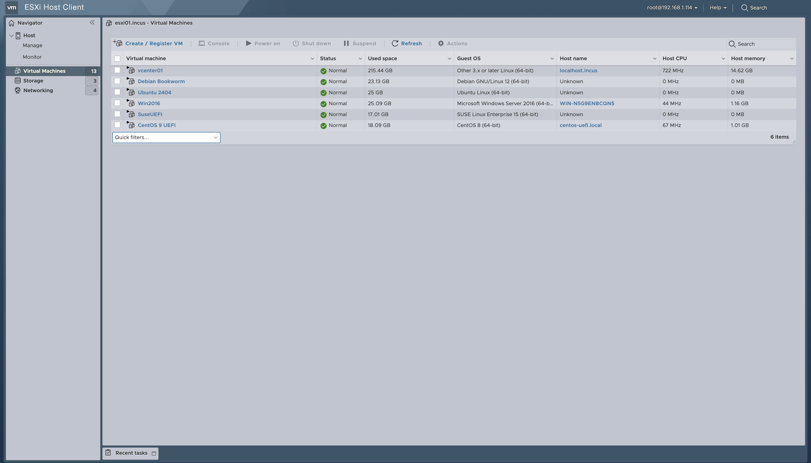

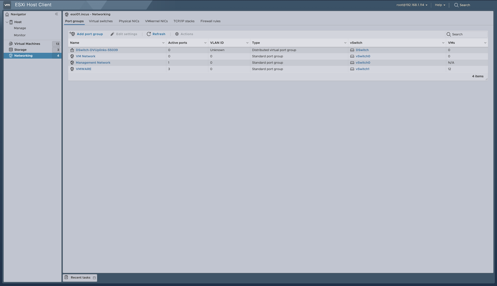

## Register a source

The first step is to add the source. For this example, the source will be an ESXi deployment at `https://10.10.0.3`

`````{tabs}

````{group-tab} Web interface

Enter your ESXI credentials and verify the displayed certificate fingerprint.


Connectivity status should display as `OK` to indicate the source has been successfully registered:
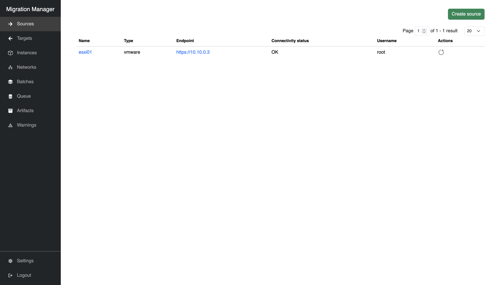

````

````{group-tab} Command line

    $ migration-manager source add "esxi01" "https://10.10.0.3"
    Please enter username for endpoint 'https://10.10.0.3': user
    Please enter password for endpoint 'https://10.10.0.3': <password>
    How many instances can be concurrently imported? [default=50]:
    Successfully added new source "esxi01", but received an untrusted TLS server certificate with fingerprint ba4f5b7749bc76e11fdce0dba27c49e6c379cfb9b4c7de14844442d9b6df5726. Please update the source to correct the issue.

    $ migration-manager source list
    +--------+--------+-------------------+-------------------------+----------+-------------------------------------+
    |  Name  |  Type  |     Endpoint      |   Connectivity Status   | Username | Trusted TLS Cert SHA256 Fingerprint |
    +--------+--------+-------------------+-------------------------+----------+-------------------------------------+
    | esxi01 | vmware | https://10.10.0.3 | Confirm TLS fingerprint | user     |                                     |
    +--------+--------+-------------------+-------------------------+----------+-------------------------------------+

    $ migration-manager source update "esxi01"
    Source name [default=esxi01]:
    Endpoint [default=https://10.10.0.3]:
    Update configured authentication? (yes/no) [default=no]: no
    How many instances can be concurrently imported? [default=50]:
    Manually-set trusted TLS cert SHA256 fingerprint []: ba4f5b7749bc76e11fdce0dba27c49e6c379cfb9b4c7de14844442d9b6df5726
    Successfully updated source "esxi01".

    $ migration-manager source list
    +--------+--------+-------------------+---------------------+----------+------------------------------------------------------------------+
    |  Name  |  Type  |     Endpoint      | Connectivity Status | Username |               Trusted TLS Cert SHA256 Fingerprint                |
    +--------+--------+-------------------+---------------------+----------+------------------------------------------------------------------+
    | esxi01 | vmware | https://10.10.0.3 | OK                  | user     | ba4f5b7749bc76e11fdce0dba27c49e6c379cfb9b4c7de14844442d9b6df5726 |
    +--------+--------+-------------------+---------------------+----------+------------------------------------------------------------------+

````

`````

After this, instances and their networks will be imported from the source:

`````{tabs}

````{group-tab} Web interface

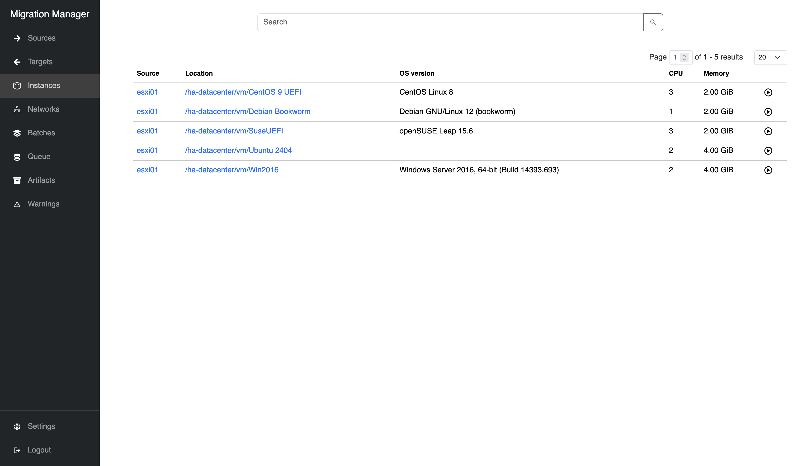
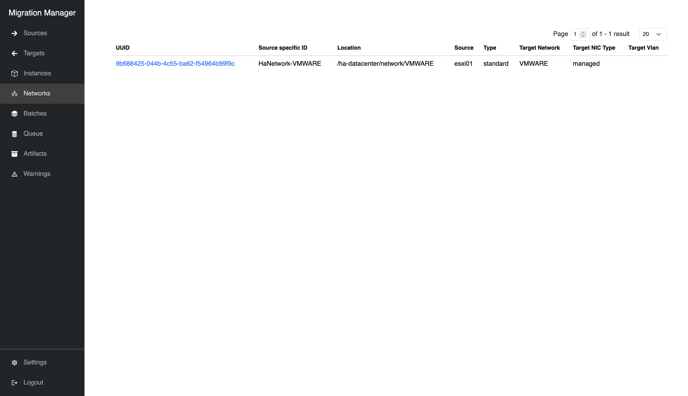

````

````{group-tab} Command line

    $ migration-manager instance list
    +--------------------------------------+--------+-----------------------------------+-----------------------------------------------+------+---------+-------------------+--------------------+
    |                 UUID                 | Source |             Location              |                  OS Version                   | CPUs | Memory  | Background Import | Migration Disabled |
    +--------------------------------------+--------+-----------------------------------+-----------------------------------------------+------+---------+-------------------+--------------------+
    | 52cfcb6b-20ee-add3-adc9-68c63ca9adfd | esxi01 | /ha-datacenter/vm/Win2016         | Windows Server 2016, 64-bit (Build 14393.693) | 2    | 4.00GiB | true              | false              |
    +--------------------------------------+--------+-----------------------------------+-----------------------------------------------+------+---------+-------------------+--------------------+
    | 52d5cfe0-d341-82d9-3f23-4149687b4e3e | esxi01 | /ha-datacenter/vm/Ubuntu 2404     |                                               | 2    | 4.00GiB | true              | false              |
    +--------------------------------------+--------+-----------------------------------+-----------------------------------------------+------+---------+-------------------+--------------------+
    | 52d89a93-ff8f-9dea-4d74-ec99beb1d2d4 | esxi01 | /ha-datacenter/vm/Debian Bookworm | Debian GNU/Linux 12 (bookworm)                | 3    | 6.00GiB | true              | false              |
    +--------------------------------------+--------+-----------------------------------+-----------------------------------------------+------+---------+-------------------+--------------------+
    | 5263adbf-dbca-eb36-3019-b09743f40b6d | esxi01 | /ha-datacenter/vm/Cent OS 9 UEFI  | CentOS Stream 9                               | 6    | 6.00GiB | true              | false              |
    +--------------------------------------+--------+-----------------------------------+-----------------------------------------------+------+---------+-------------------+--------------------+
    | 5298cc11-96ea-4f50-b018-6d80bfdaa7d9 | esxi01 | /ha-datacenter/vm/SuseUEFI        | openSUSE Leap 15.6                            | 3    | 6.00GiB | true              | false              |
    +--------------------------------------+--------+-----------------------------------+-----------------------------------------------+------+---------+-------------------+--------------------+

    $ migration-manager network list
    +--------------------------------------+--------------------+-------------------------------+--------+----------+----------------+-----------------+-------------+
    |                 UUID                 | Source Specific ID |           Location            | Source |   Type   | Target Network | Target NIC Type | Target Vlan |
    +--------------------------------------+--------------------+-------------------------------+--------+----------+----------------+-----------------+-------------+
    | 8df4f8e3-b446-4631-87a8-f7f97fce3109 | HaNetwork-VMWARE   | /ha-datacenter/network/VMWARE | esxi01 | standard | VMWARE         | managed         |             |
    +--------------------------------------+--------------------+-------------------------------+--------+----------+----------------+-----------------+-------------+

````

`````

```{note}
For the best possible experience, ensure VMs have background import (change tracking) enabled. See [Enable change tracking](../reference/sources/vmware.md#change-tracking) for details.

Without change tracking, migrations cannot occur with running VMs, prolonging downtime.

```

The default `Target Network` for `/ha-datacenter/network/VMWARE` is determined to be `VMWARE`. Ensure a network by this name exists on the Incus target.

## Register a target

The next step is to add a target, this follows a similar pattern to sources. Here we add an [Incus](https://linuxcontainers.org/incus/) cluster located at `https://10.1.0.101:8443`

`````{tabs}

````{group-tab} Web interface

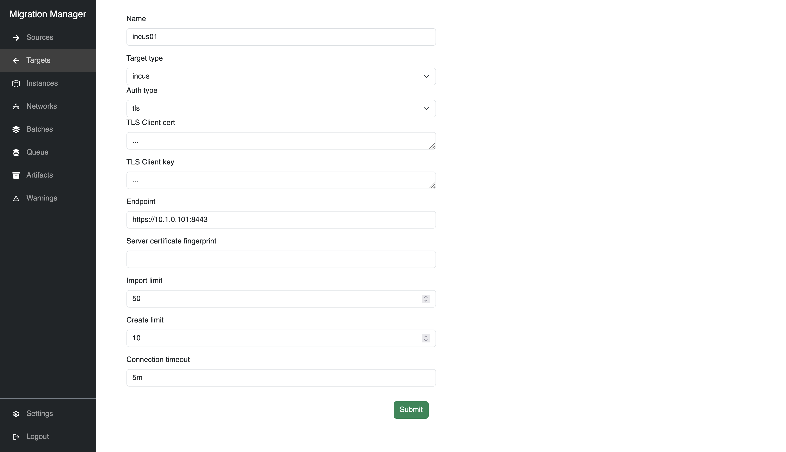
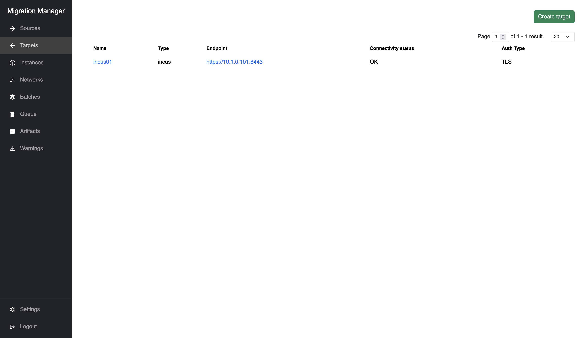

````

````{group-tab} Command line

    $ migration-manager  target add "incus01" "https://10.1.0.101:8443"
    How many instances can be concurrently imported? [default=50]:
    How many instances can be concurrently created? [default=10]:
    Specify the timeout for connecting to the target [default=5m0s]:
    Use OIDC or TLS certificates to authenticate to target? [default=oidc]: tls
    Please enter the absolute path to client TLS certificate: /path/to/client.crt
    Please enter the absolute path to client TLS key: /path/to/client.key
    Successfully added new target "incus01", but received an untrusted TLS server certificate with fingerprint d0d4e9f057523006b30ba8e1f269d048238853786956d7285ca325077ba5e8ca. Please update the target to correct the issue.

    $ migration-manager target update incus01
    Target name [default=incus01]:
    Endpoint [default=https://10.1.0.101:8443]:
    How many instances can be concurrently imported? [default=50]:
    How many instances can be concurrently created? [default=10]:
    Specify the timeout for connecting to the target [default=5m0s]:
    Update configured authentication? (yes/no) [default=no]:
    Manually-set trusted TLS cert SHA256 fingerprint []: d0d4e9f057523006b30ba8e1f269d048238853786956d7285ca325077ba5e8ca
    Successfully updated target "incus01".

    $ migration-manager target list
    +---------+-------+-------------------------+---------------------+-----------+------------------------------------------------------------------+
    |  Name   | Type  |        Endpoint         | Connectivity Status | Auth Type |               Trusted TLS Cert SHA256 Fingerprint                |
    +---------+-------+-------------------------+---------------------+-----------+------------------------------------------------------------------+
    | incus01 | incus | https://10.1.0.101:8443 | OK                  | TLS       | d0d4e9f057523006b30ba8e1f269d048238853786956d7285ca325077ba5e8ca |
    +---------+-------+-------------------------+---------------------+-----------+------------------------------------------------------------------+

````

`````

```{tip}

 targets also support OIDC authentication if set up.

```

## Creating a batch

Refer to [Batches](../reference/batches) for more details about batch configuration.

Now we can create a batch of instances to be migrated, and set up the migration plan. In this case, we will assume target `incus01` has a storage pool named `default`, and a project named `default` with a network named `incusbr0`.

`````{tabs}

````{group-tab} Web interface

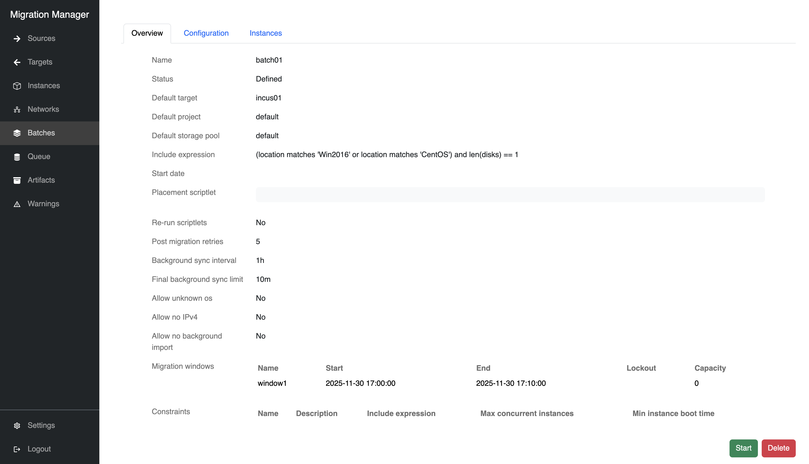
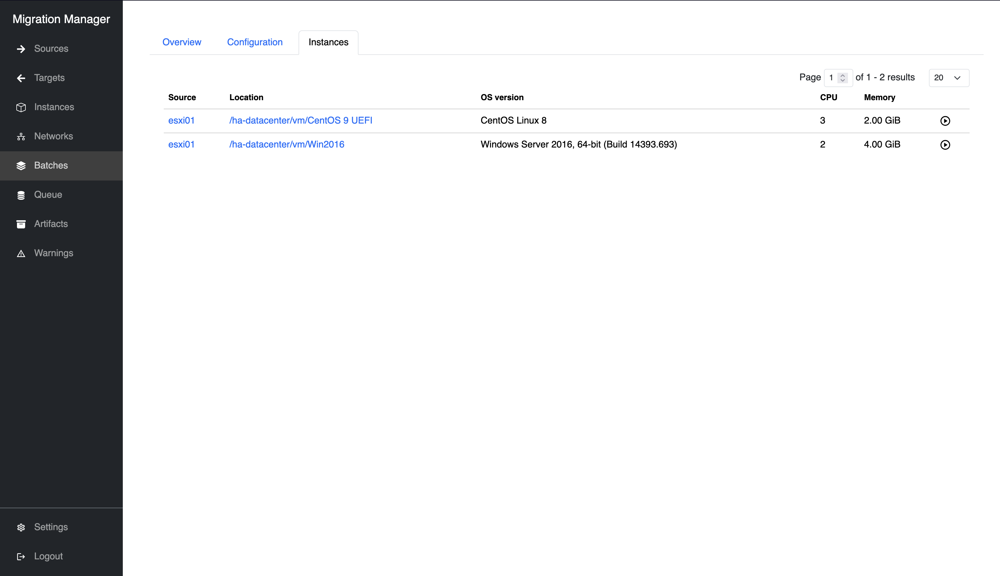

````

````{group-tab} Command line

    $ migration-manager batch add "batch01"
    Successfully added new batch "batch01".

    $ migration-manager batch edit "batch01"
    ### This is a YAML representation of batch configuration.
    ### Any line starting with a '# will be ignored.
    ###

    name: batch01
    include_expression: "(location matches 'Win2016' or location matches 'CentOS') and len(disks) == 1"
    migration_windows:
      - name: window1
        start: 2025-12-01 01:00:00
        end: 2025-12-01 01:10:00
    constraints: []
    defaults:
        placement:
            target: incus01
            target_project: default
            storage_pool: default
        migration_network: []
    config:
        rerun_scriptlets: false
        placement_scriptlet: ""
        post_migration_retries: 5
        instance_restriction_overrides:
            allow_unknown_os: false
            allow_no_ipv4: false
            allow_no_background_import: false
        background_sync_interval: 1h
        final_background_sync_limit: 10m

The matching instances in a batch can then be inspected:

    $ migration-manager batch info "batch01"
    Matched Instances:
      - /ha-datacenter/vm/CentOS 9 UEFI
      - /ha-datacenter/vm/Win2016

    Queued Instances:

````

`````

Here we have set up an `include_expression` filter that matches 2 instances from a source: the location path contains either `Win2016` or `CentOS`, and all matches must have exactly one disk.
Most fields are left with their defaults, and we have added a single migration window that lasts 10 minutes. While waiting for the migration window to begin, background sync will top-up every 1 hour, and perform one final top-up 10 minutes before the migration window starts.

Once the batch is explicitly started, the target instances will be created on the target, and begin pulling data from the still-running source VMs. The source VMs will not be stopped until the migration window starts, and if the migration does not complete before the window ends, then the migration will fail for that VM and it will be turned back on.

## Adding required artifacts

Some external files are required for migrations to proceed. See [artifacts](../reference/artifacts)

## Migrating a batch

With all of the above in place, we can now start the batch and observe the queue:

`````{tabs}

````{group-tab} Web interface

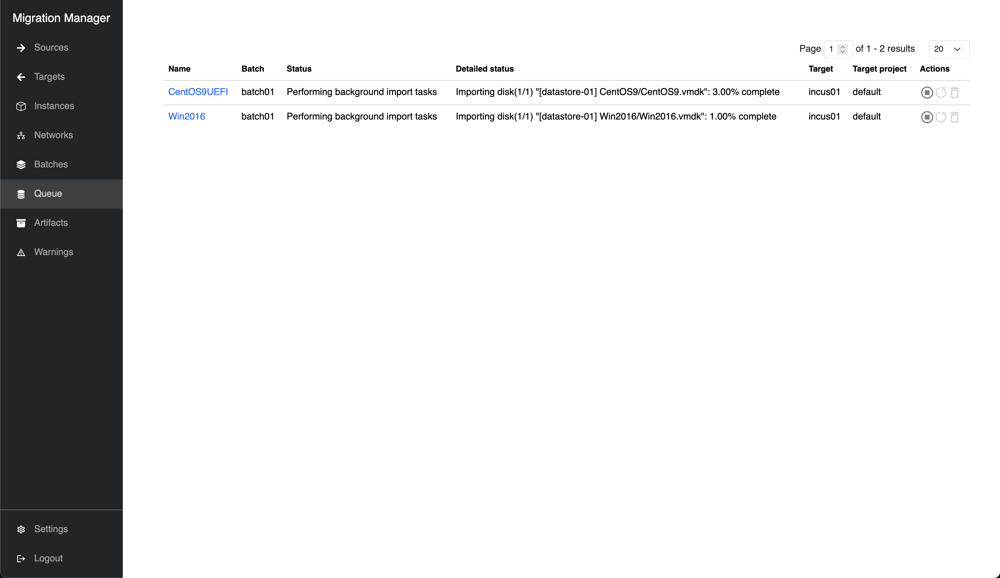

After background import is complete, the migration will halt temporarily until the migration window starts. Periodically, data will be topped up without shutting off the source VM.

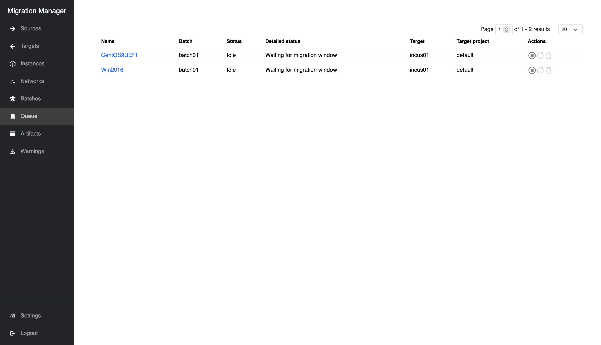

Finally, the migration has completed! The source VM will have powered off, and the target instance should now be running:

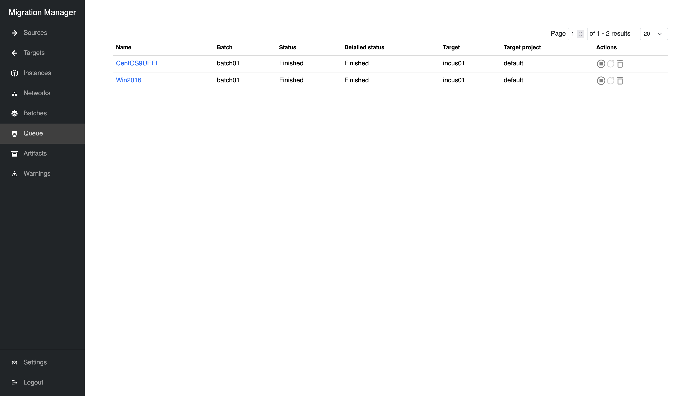

````

````{group-tab} Command line

    $ migration-manager batch start "batch01"
    Successfully started batch "batch01".

    $ migration-manager queue list
    +--------------+---------+-------------+------------------------------------+----------------------------------------------------------------------------+---------------------------------------------------------------+
    |     Name     |  Batch  | Last Update |               Status               |                              Status Message                                |                       Migration Window                        |
    +--------------+---------+-------------+------------------------------------+----------------------------------------------------------------------------+---------------------------------------------------------------+
    | CentOS9UEFI  | batch01 | 4s ago      | Performing background import tasks | Importing disk (1/1) "[datastore-01] CentOS9/CentOS9.vmdk": 3.00% complete | 2025-12-01 01:00:00 +0000 UTC - 2025-12-01 01:10:00 +0000 UTC |
    +--------------+---------+-------------+------------------------------------+----------------------------------------------------------------------------+---------------------------------------------------------------+
    | Win2016      | batch01 | 4s ago      | Performing background import tasks | Importing disk (1/1) "[datastore-01] Win2016/Win2016.vmdk": 1.00% complete | 2025-12-01 01:00:00 +0000 UTC - 2025-12-01 01:10:00 +0000 UTC |
    +--------------+---------+-------------+------------------------------------+----------------------------------------------------------------------------+---------------------------------------------------------------+

After background import is complete, the migration will halt temporarily until the migration window starts. Periodically, data will be topped up without shutting off the source VM.

    $ migration-manager queue list
    +--------------+---------+-------------+--------+------------------------------+---------------------------------------------------------------+
    |     Name     |  Batch  | Last Update | Status |        Status Message        |                       Migration Window                        |
    +--------------+---------+-------------+--------+------------------------------+---------------------------------------------------------------+
    | CentOS9UEFI  | batch01 | 4s ago      | Idle   | Waiting for migration window | 2025-12-01 01:00:00 +0000 UTC - 2025-12-01 01:10:00 +0000 UTC |
    +--------------+---------+-------------+--------+------------------------------+---------------------------------------------------------------+
    | Win2016      | batch01 | 4s ago      | Idle   | Waiting for migration window | 2025-12-01 01:00:00 +0000 UTC - 2025-12-01 01:10:00 +0000 UTC |
    +--------------+---------+-------------+--------+------------------------------+---------------------------------------------------------------+

Finally, the migration has completed! The source VM will have powered off, and the target instance should now be running:

    $ migration-manager queue list
    +--------------+---------+-------------+----------+----------------+------------------+
    |     Name     |  Batch  | Last Update |  Status  | Status Message | Migration Window |
    +--------------+---------+-------------+----------+----------------+------------------+
    | CentOS9UEFI  | batch01 | 4s ago      | Finished |    Finished    |       none       |
    +--------------+---------+-------------+----------+----------------+------------------+
    | Win2016      | batch01 | 4s ago      | Finished |    Finished    |       none       |
    +--------------+---------+-------------+----------+----------------+------------------+

````

`````
