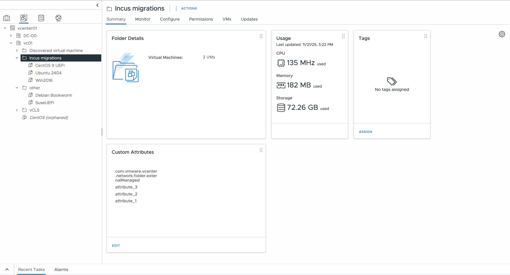
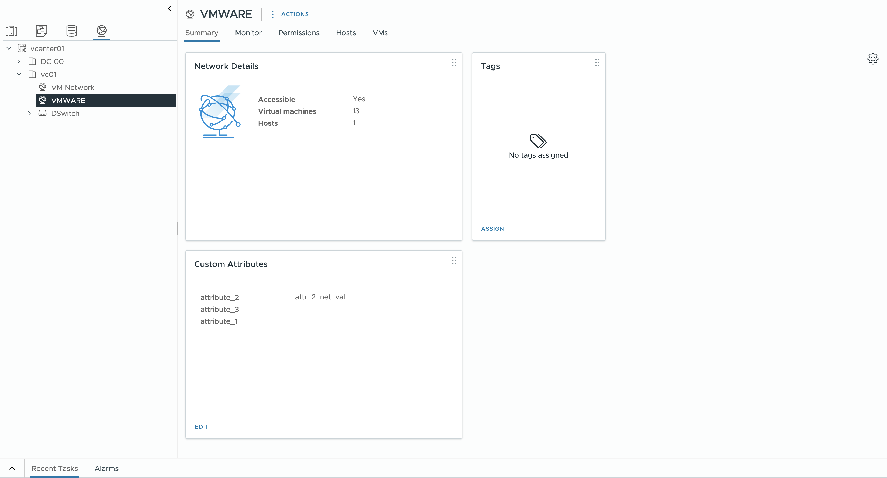
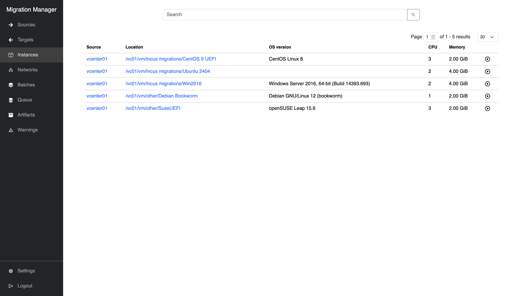
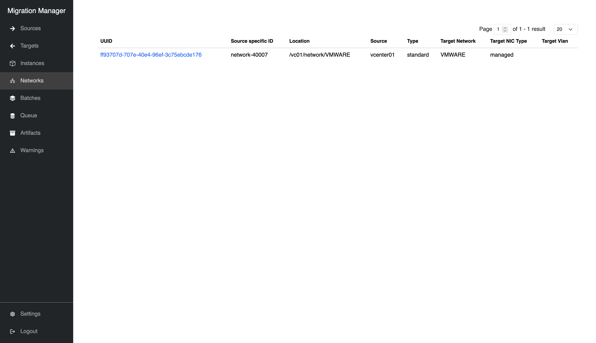
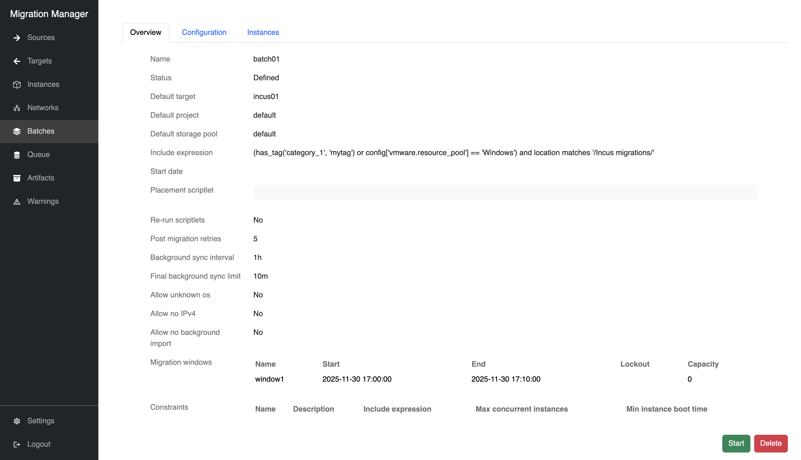
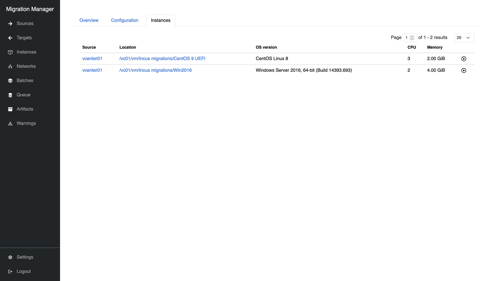

# Migrate a batch of instances (vCenter)

This is an example guide for migrating instances from VMware vCenter to [Incus](https://linuxcontainers.org/incus/).

Overview of the available VMs and networks in the vCenter deployment:




## Register a source

```{note}

The vCenter credentials used to register with Migration Manager are required to have a minimum set of privileges. See [vCenter access requirements](../reference/sources/vmware.md#required-permissions)

```

Refer to [Register a source (ESXi)](migrate_esxi.md#register-a-source) for a step by step guide.
The process for registering a source for vCenter is the same as for ESXI.

After registering the source, instances and their networks will be imported from the source with vCenter-specific properties:

`````{tabs}

````{group-tab} Web interface




````

````{group-tab} Command line

    $ migration-manager instance list
    +--------------------------------------+-----------+-------------------------------------------+-----------------------------------------------+------+---------+-------------------+--------------------+
    |                 UUID                 |  Source   |                 Location                  |                  OS Version                   | CPUs | Memory  | Background Import | Migration Disabled |
    +--------------------------------------+-----------+-------------------------------------------+-----------------------------------------------+------+---------+-------------------+--------------------+
    | 52cfcb6b-20ee-add3-adc9-68c63ca9adfd | vcenter01 | /vc01/vm/Incus migrations/Win2016         | Windows Server 2016, 64-bit (Build 14393.693) | 2    | 4.00GiB | true              | false              |
    +--------------------------------------+-----------+-------------------------------------------+-----------------------------------------------+------+---------+-------------------+--------------------+
    | 52d5cfe0-d341-82d9-3f23-4149687b4e3e | vcenter01 | /vc01/vm/Incus migrations/Ubuntu 2404     |                                               | 2    | 4.00GiB | true              | false              |
    +--------------------------------------+-----------+-------------------------------------------+-----------------------------------------------+------+---------+-------------------+--------------------+
    | 52d89a93-ff8f-9dea-4d74-ec99beb1d2d4 | vcenter01 | /vc01/vm/other/Debian Bookworm            | Debian GNU/Linux 12 (bookworm)                | 3    | 6.00GiB | true              | false              |
    +--------------------------------------+-----------+-------------------------------------------+-----------------------------------------------+------+---------+-------------------+--------------------+
    | 5263adbf-dbca-eb36-3019-b09743f40b6d | vcenter01 | /vc01/vm/Incus migrations/Cent OS 9 UEFI  | CentOS Stream 9                               | 6    | 6.00GiB | true              | false              |
    +--------------------------------------+-----------+-------------------------------------------+-----------------------------------------------+------+---------+-------------------+--------------------+
    | 5298cc11-96ea-4f50-b018-6d80bfdaa7d9 | vcenter01 | /vc01/vm/other/SuseUEFI                   | openSUSE Leap 15.6                            | 3    | 6.00GiB | true              | false              |
    +--------------------------------------+-----------+-------------------------------------------+-----------------------------------------------+------+---------+-------------------+--------------------+

    $ migration-manager network list
    +--------------------------------------+--------------------+----------------------+-----------+----------+----------------+-----------------+-------------+
    |                 UUID                 | Source Specific ID |           Location   |  Source   |   Type   | Target Network | Target NIC Type | Target Vlan |
    +--------------------------------------+--------------------+----------------------+-----------+----------+----------------+-----------------+-------------+
    | 8df4f8e3-b446-4631-87a8-f7f97fce3109 |   network-40007    | /vc01/network/VMWARE | vcenter01 | standard | VMWARE         | managed         |             |
    +--------------------------------------+--------------------+----------------------+-----------+----------+----------------+-----------------+-------------+

````

`````

```{note}
For the best possible experience, ensure VMs have background import (change tracking) enabled. See [Enable change tracking](../reference/sources/vmware.md#change-tracking) for details.

Without change tracking, migrations cannot occur with running VMs, prolonging downtime.

```

### Folders, resource pools, and tags

On top of the default properties imported from ESXi sources, Migration Manager supports tags, resource pools, and folder structure from vCenter:

- Tags are available as config keys, prefixed with `tag.<category>` with tags as comma-separated values
- Resource pools are available as config keys, prefixed with `vmware.resource_pool` with the resource pool name as the value
- Folder structure is included in the `location` path identifying the instance

## Register a target

Refer to [Register a target (Incus)](migrate_esxi.md#register-a-target) for a step by step guide.
The process for registering a target for vCenter is the same as for ESXi.

## Creating a batch

Refer to [Batches](../reference/batches) for more details about batch configuration.

Now we can create a batch of instances to be migrated, and set up the migration plan. In this case, we will assume target `incus01` has a storage pool named `default`, and a project named `default` with a network named `incusbr0`.

`````{tabs}

````{group-tab} Web interface




````

````{group-tab} Command line

    $ migration-manager batch add "batch01"
    Successfully added new batch "batch01".

    $ migration-manager batch edit "batch01"
    ### This is a YAML representation of batch configuration.
    ### Any line starting with a '# will be ignored.
    ###

    name: batch01
    include_expression: "(has_tag('category_1', 'mytag') or config['vmware.resource_pool'] == 'Windows') and location matches '/Incus migrations/'"
    migration_windows:
      - name: window1
        start: 2025-12-01 01:00:00
        end: 2025-12-01 01:10:00
    constraints: []
    defaults:
        placement:
            target: incus01
            target_project: default
            storage_pool: default
        migration_network: []
    config:
        rerun_scriptlets: false
        placement_scriptlet: ""
        post_migration_retries: 5
        instance_restriction_overrides:
            allow_unknown_os: false
            allow_no_ipv4: false
            allow_no_background_import: false
        background_sync_interval: 1h
        final_background_sync_limit: 10m

The matching instances in a batch can then be inspected:

    $ migration-manager batch info "batch01"
    Matched Instances:
      - /vc01/vm/Incus migrations/CentOS 9 UEFI
      - /vc01/vm/Incus migrations/Win2016

    Queued Instances:

````

`````

Here we have set up an `include_expression` filter that matches the instances with tag `mytag` in category `category_1` or the instances in the resource pool named `Windows` in the folder `Incus migrations`.
Most fields are left with their defaults, and we have added a single migration window that lasts 10 minutes. While waiting for the migration window to begin, background sync will top-up every 1 hour, and perform one final top-up 10 minutes before the migration window starts.

Once the batch is explicitly started, the target instances will be created on the target, and begin pulling data from the still-running source VMs. The source VMs will not be stopped until the migration window starts, and if the migration does not complete before the window ends, then the migration will fail for that VM and it will be turned back on.

## Adding required artifacts

Some external files are required for migrations to proceed. See [artifacts](../reference/artifacts)

## Migrating a batch

Refer to [Migrating a batch (ESXi)](migrate_esxi.md#migrating-a-batch) for a step by step guide.
The process for migrating a batch from vCenter is the same as for ESXi.
